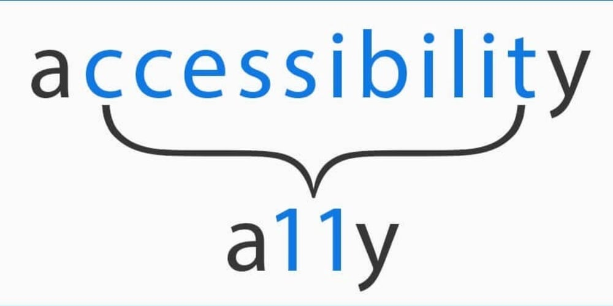

Como desenvolvedores front-end, ter um pé em usabilidade e entender como entregar uma boa experiencia para o nosso usuário é uma peça fundamental. E para sermos inclusivos e entregarmos uma usabilidade boa para *todos os usuários*, precisamos que nosso front seja acessível, mas por onde começar? Como testar e garantir uma boa acessibilidade? 

## O que é acessibilidade e porque é importante

## WCAG

Web Content Accessibility Guidelines.

## Leitores de tela

## Teclado

## WAI-ARIA

## Boas práticas

## Testando

## Ferramentas e referências