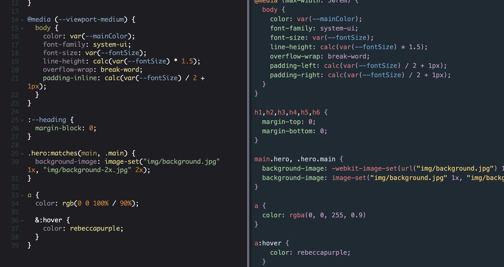

[PostCSS](https://postcss.org/) é uma ferramenta que já está no mercado a um bom tempo, e nos permite "compilar" um código escrito com uma sintax diferente, para CSS puro. Essa sintax diferente nos permite através de plugins customizar a forma como escrevemos CSS, de forma a torná-lo mais simples ou mais eficiente por exemplo. Para quem já conhece o PostCSS é muito similar ao [Babel](https://babeljs.io/) que é o compiler (ou transpiler) mais famoso de Javascript.

> Caso queira saber mais sobre o que é um compiler ou transpiler, [recomendo esse texto](https://www.stevefenton.co.uk/2012/11/compiling-vs-transpiling/).

Nesse post vamos ver como usar o PostCSS em conjunto com o seu plugin [Preset Env](https://preset-env.cssdb.org/), de forma que seja possível escrevermos CSS utilizando funcionalidades que ainda não existem nos navegadores, e mesmo assim obter um CSS que rode sem problemas neles.


## Futuro do CSS

Antes de ir para a prática vamos entender o que são essas funcionalidades novas. De forma *resumida* assim como no Javascript o CSS possui um processo de adição de novas funcionalidades, que são organizadas em etapas (Stages). E em cada etapa passam por diferentes tipos de testes e requisitos, até que finalmente são implementadas pelos navegadores (como o Chrome). Só que esse processo é bem longo e demorado, então enquanto essas funcionalidades não chegam nos navegadores, podemos utilizar ferramentas como o PostCSS para traduzirem essas funcionalidades novas em CSS atual.

Podemos ver as próximas funcionalidades do CSS nos links abaixo:

[CSS DB: Lista de funcionalidades](https://cssdb.org/).
[PostCSS Preset Env: Cada funcionalidade e exemplos](https://preset-env.cssdb.org/features).

### Stages

Vamos falar um pouco sobre as etapas pelas quais cada funcionalidade passa:

- *Stage 0: Ambição* - Uma ideia ou um rascunho de uma nova funcionalidade
- *Stage 1: Experimento* - Um teste/experimento que procura resolver/melhorar a linguagem
- *Stage 2: Possível* - Quando a nova funcionalidade já possui uma solução técnica mas ainda pode mudar
- *Stage 3: Adotado* - Foi adotada pela comunidade tanto como ideia quanto tecnicamente e terá poucas mudanças
- *Stage 4: Padronizado* - É um novo padrão na web e será implementada pelos navegadores, etc
- *X: Rejeitado* - A proposta foi rejeitada

## Como utilizar

Primeiro de tudo o jeito mais fácil de começar a brincar com as novas funcionalidades do CSS é utilizando o [playground do próprio Preset Env](https://preset-env.cssdb.org/playground), onde é possível testar todas as funcionalidades de todos os Stages e ver na hora o CSS gerado como resultado do compiler.

Recomendo brincar um pouco la e descobrir as novas funcionalidades. Duas bem bacanas que estão mudando bastante a forma de se usar CSS puro são:

- [Custom Properties](https://developer.mozilla.org/en-US/docs/Web/CSS/Using_CSS_custom_properties) - Que inclusive já foram implementadas pelos navegadores mais modernos e estão no Stage 3.
- [Nesting Rules](https://drafts.csswg.org/css-nesting/#:~:text=A%20style%20rule%20can%20be,compound%20selector%20of%20the%20selector.) - Que nos permite escrever CSS em cascata (como nos pre-processadores Sass/Less/Stylus), porém ainda está no Stage 1.

### Instalando no meu projeto

Normalmente o PostCSS já possui integrações com os frameworks mais famosos do mercado (como React, Angular e Vue), nesses casos recomendo que você veja a documentação do seu framework ou checar a documentação do Bundler utilizado (Webpack, Rollup). Vou deixar alguns links no final do post para tutoriais explicando como instalar em cada framework/bundler.

Para utilizarmos o Preset Env junto com o PostCSS primeiro instalamos tanto o PostCSS com o Preset Env:

```bash
$ npm install postcss postcss-preset-env --save-dev
```

Depois criamos um arquivo chamado `postcss.config.js` e adicionamos a nossa configuração:

```js
module.exports = {
  plugins: {
    'postcss-preset-env': { /* Opções */ },
  }
}
```

Depois podemos configurá-lo por exemplo para usarmos todas as novas funcionalidades desde o Stage 1:

```js
module.exports = {
  plugins: {
    'postcss-preset-env': {
      stage: 1
    },
  }
}
```

Podemos também habilitar funcionalidades especificas ou definir para quais navegadores o PostCSS deve gerar o nosso CSS:

```js
module.exports = {
  plugins: {
    'postcss-preset-env': {
      stage: 3 // Esse Stage não suporta Nesting Rules
      features: {
        'nesting-rules': true // Porém aqui forçamos que ela seja utilizada
      },
      browsers: 'last 2 versions' 
      // Aqui dizemos que o PostCSS deve compilar funcionalidades 
      // Que não rodem nas ultimas 2 versões dos navegadores mais comuns no mercado
    },
  }
}
```

> Para saber mais sobre a parte de browsers do PostCSS e como configurar [recomendo esse link](https://css-tricks.com/browserlist-good-idea/).

## #done

Espero que tenham gostado, e qualquer dúvida ou sugestão só mandar um comentário aqui em baixo ou uma mensagem no Twitter.

Obrigado por ler!

## Referencias e links úteis

- [PostCSS Preset Env](https://github.com/csstools/postcss-preset-env)
- [PostCSS](https://postcss.org/)
- [Next.js com PostCSS](https://nextjs.org/docs/advanced-features/customizing-postcss-config)
- [Vue Loader com PostCSS](https://vue-loader.vuejs.org/guide/pre-processors.html#postcss)
- [Vite com PostCSS](https://github.com/vitejs/vite#postcss)
- [Webpack com PostCSS](https://webpack.js.org/loaders/postcss-loader/)