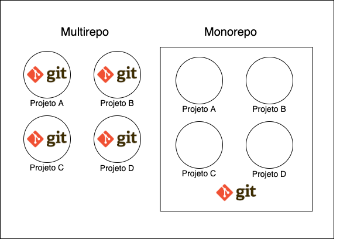
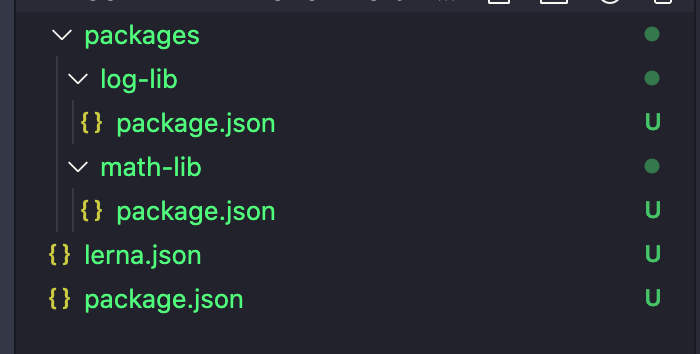
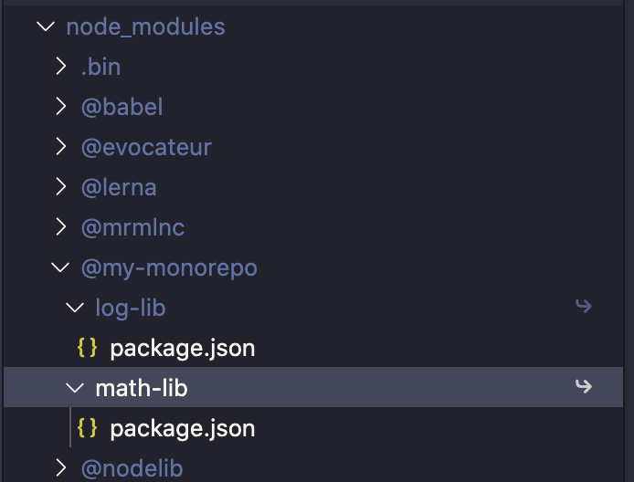
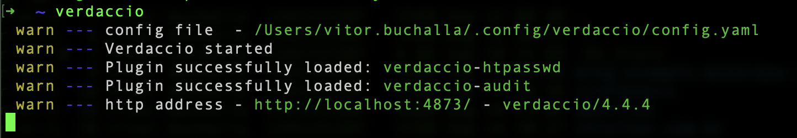
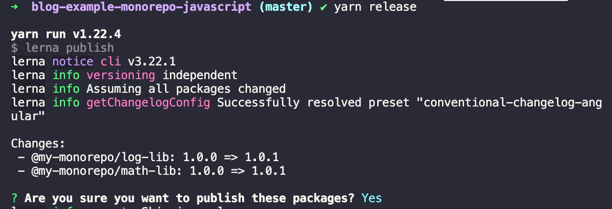
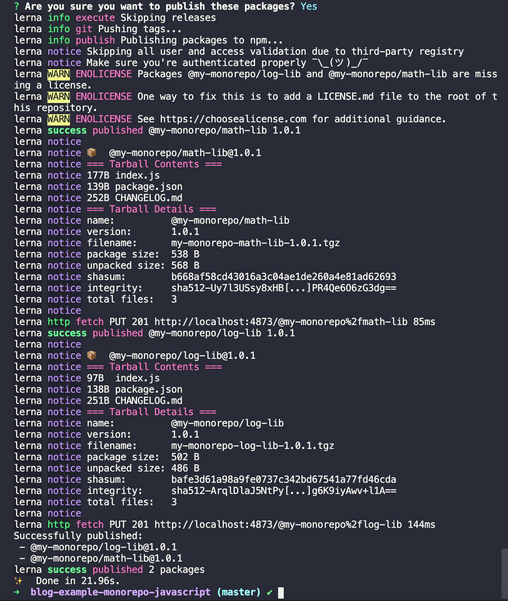
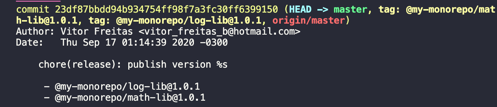

Já ouviu falar do termo Monorepo? Ou Multirepo? São termos utilizados para definir dois modelos arquiteturais, onde resumidamente são formas de definirmos se iremos manter nosso código de vários projetos em apenas um repositório versionado (git) ou em vários repositórios onde cada projeto irá ter o seu git por exemplo.

Nesse post vamos falar sobre como criar o seu monorepo utilizando Javascript, não muito sobre quais são os casos indicados de cada arquitetura, ou seus prós e contras, porém vou deixar aqui uma comparação simples das duas abordagens:

## Multirepo

- Vários repositórios, normalmente 1 por projeto.
- Cada projeto tem o seu processo de deploy separado, com testes automatizados e builds apenas daquele projeto, sendo então mais rápidos e previsíveis.
- Cada repositório tem as suas dependências com suas versões e é independente, porém normalmente isso leva a duplicidade de dependências, ou a conflito de versões.
- Os times possuem mais autonomia, podendo realizar mudanças em seu repositório sem envolver outros times.

## Monorepo

- Um repositório para vários projetos e times.
- Como temos um repositório só é "mais simples" para novos membros se situarem.
- Os times tem menos autonomia, já que qualquer mudança pode impactar outros projetos, e boa parte das alterações devem ser alinhadas e planejadas entre os times.
- As dependências dos projetos são unificadas e centralizadas, fazendo com que todos os projetos respeitem uma mesma versão de uma dependência X, assim gerando menos conflitos e duplicamento de dependências.

Tem vários outros pontos a se levar em conta na hora de escolher qual caminho deve ser tomado na sua empresa/projeto, lembre-se, não existe bala de prata ;), mas realizar uma escolha que faça sentido com a cultura da empresa, e dos times envolvidos, com certeza trará mais benefícios.

Agora vamos para a prática ;)

## Início do projeto

Para começar vamos criar um novo projeto, que será um monorepo e que terá a princípio duas bibliotecas. Para isso vamos utilizar duas ferramentas importantes, o [Lerna](https://lerna.js.org/) e o [Yarn Workspaces](https://classic.yarnpkg.com/en/docs/workspaces/). Cada uma delas tem o seu papel em nos fornecer funcionalidades que vão nos ajudar a gerenciar nosso monorepo, por isso devem ser usadas em conjunto, já que *uma não substitui a outra*.

Vamos falar um pouco dos dois antes de partir pro código.

### Yarn Workspaces

O Yarn é um gerenciador de dependências assim como o npm, e possui a funcionalidade de workspaces que nos permite gerenciar repositórios que são monorepos. Basicamente o Yarn Workspaces fica responsável por gerenciar as dependências do projeto e fazer a distinção de quais dependências são utilizadas por qual projeto dentro do monorepo, e quais são globais e servem para o projeto como um todo. Cuidando então da parte mais de "baixo" de um monorepo.

>A funcionalidade de workspaces do Yarn, também está sendo criada pelo time do NPM, e vai estar disponível no [NPM@7.0.0](https://blog.npmjs.org/post/617484925547986944/npm-v7-series-introduction). Depois que ele for lançado irei atualizar esse artigo ou criar um novo comparando com o Yarn no uso com monorepos.

### Lerna

Já o Lerna é uma ferramenta que cuida da parte mais de "cima" de um monorepo, trazendo facilidades ao gerenciar um monorepo, e quando utilizado em conjunto com o Yarn Workspaces, ele deixa todo o trabalho de gerenciamento de dependências com o Yarn, e cuida mais da parte de execução de comandos, e publicação desses pacotes, assim como gerenciando a versão (utilizando [semver](https://semver.org/)) de cada projeto, seja com uma versão única para todos, ou diferente.

Agora para começar vamos instalar os dois:

>O Yarn possui seus próprios métodos de [instalação dependendo do sistema operacional](https://classic.yarnpkg.com/en/docs/install).
> Para manter a simplicidade iremos instalar da forma mais simples, apesar de [não recomendada pelo Yarn](https://classic.yarnpkg.com/en/docs/install/#alternatives-stable)

```bash
$ npm install -g yarn
$ npm install -g lerna
```

Depois podemos criar nosso projeto usando a CLI do Lerna:

```bash
$ lerna init
```

Agora precisamos integrar o Yarn Workspaces com o Lerna, para isso precisamos adicionar duas configurações, e configurar o `package.json` das nossas duas bibliotecas!

package.json
```json
{
  // ...
  "private": true, // E dizemos pro Yarn que esse package.json princípal, é privado, e não deve ser publicado
  "workspaces": { // Adicionamos essa entrada mapeando o mesmo caminho de packages que já veio
    "packages": [ // configurado pelo Lerna. Essa entrada é para avisar o Yarn workspaces, quais são os 
      "packages/**" // seus workspaces
    ]
  },
  // ...
}

```

lerna.json
```json
{
  "npmClient": "yarn", // Indicamos ao Lerna que estamos usando o yarn invés do npm
  "useWorkspaces": true, // E dizemos que o workspaces do yarn esta habilitado
  "packages": [
    "packages/*"
  ],
  "version": "0.0.0"
}
```

E depois criamos dois `packages` que serão nossas bibliotecas, e adicionamos um `package.json` para cada:



packages/log-lib/package.json
```json
{
  "name": "@my-monorepo/log-lib",
  "main": "index.js",
  "version": "1.0.0"
}
```

packages/math-lib/package.json
```json
{
  "name": "@my-monorepo/math-lib",
  "main": "index.js",
  "version": "1.0.0"
}
```

E depois rodamos o comando referente ao `npm install` do Yarn, para que ele possa identificar nossos workspaces, e baixar tudo que for preciso.

```bash
$ yarn
```

Agora se olharmos no `node_modules` do nosso projeto, podemos ver que o Yarn já cuidou de criar as referencias aos nossas duas bibliotecas, e deixar disponível para caso outro projeto dentro do monorepo queira utiliza-lo:



## Publicando nossos pacotes

Agora vamos ver como publicar nossos pacotes e testá-los localmente, e depois como publicá-los diretamente no NPM ou em algum outro registro privado (comum em grandes empresas).

### Verdaccio

Para publicar nossos pacotes localmente vamos utilizar o [Verdaccio](https://verdaccio.org/docs/en/installation) que é um registro privado feito com NodeJs, de fácil configuração e que nos permite adicionar ou buscar pacotes pelo NPM, da mesma forma que buscamos e adicionamos pacotes no próprio registro do NPM.

> *O que é um registro?* É basicamente um repositório de pacotes/bibliotecas que possui uma API para buscar/adicionar pacotes, é compatível com o [semver](https://semver.org/)

Para usar o Verdaccio, basta instala-lo globalmente:

```bash
$ npm install -g verdaccio
```

E iniciá-lo:

```bash
$ verdaccio
```

Ele vai retornar em qual URL o registro dele esta rodando e qual o seu arquivo de configuração:



Vamos deixar ele rolando em um terminal separado e guardar a URL dele, onde aqui _na minha máquina_ é a `http://localhost:4873/`, pois vamos precisar dela na hora de publicar nossos pacotes. E vamos acessar o arquivo de configuração que no meu caso fica em `~/.config/verdaccio/config.yaml` e adicionar as seguintes linhas dando permissão de publicação sem precisar de autenticação (*apenas para ambientes locais!*):

```yml
packages:
  '@my-monorepo/*':
      # scoped packages
      access: $all
      publish: $anonymous
      unpublish: $anonymous
```

E caso você queira já deixar essa configuração padrão para todos os pacotes futuros, podemos habilitar isso usando o `**` dentro de packages:

```yml
'**':
    access: $all
    publish: $anonymous
    unpublish: $anonymous
```

E pronto ;)

### Configurando o Lerna para publicar

Para publicar nossos pacotes e gerar versão automaticamente precisamos apenas dizer para o Lerna como queremos que ele faça isso, e rodar alguns comandos dele, além de definir no nosso `package.json` algumas informações sobre nossos pacotes.

Primeiro vamos adicionar algumas configurações no nosso `lerna.json`:

```json
{
  // ...
  // Alteramos nosso version para "independent", isso faz com que o Lerna tenha uma versão 
  // única para cada pacote nosso, assim eles podem evoluir de forma independente
  "version": "independent", 
  "command": {
    "publish": {
      "registry": "http://localhost:4873" // Aqui é a URL do Verdaccio
    },
    "version": {
      "allowBranch": ["master"], // Dizemos que a única branch que tem permissão de gerar uma versão é a master
      // Ao publicar nossos pacotes o Lerna vai automaticamente realizar um commit no repositório
      // Atualizando coisas como versões nos package.json, e criando um CHANGELOG.md
      "message": "chore(release): publicando versão",
      // Permite o Lerna pular qualquer etapa de teste ou 
      // lint na hora de realizar o commit caso seu projeto tenha
      "noCommitHooks": true,
      // Pedimos para ele ignorar mudanças no yarn.lock
      "ignoreChanges": ["yarn.lock"],
      // Diz para o Lerna usar os conventional commits para detectar a versão, explicado abaixo
      "conventionalCommits": true
    }
  }
}
```

---

> O ConventionalCommits é um padrão de mensagem de commit, que tem como o objetivo tornar as mensagens mais explicitas e 
> diretas, além de permitir que a versão daquele projeto seja gerenciado de forma automática através dessas mensagens.
> *Recomento fortemente* que você leia mais a respeito na [página oficial da convenção](https://www.conventionalcommits.org/en/v1.0.0/), e para facilitar [tem uma pequena explicação em português desse padrão.](https://github.com/BeeTech-global/bee-stylish/tree/master/commits)

Agora podemos adicionar um simples script de release no nosso `package.json` na raiz:

```json
{
  //...
  "scripts": {
    "release": "lerna publish"
  },
  //...
}
```

E para finalizar, adicionar dois arquivos javascript simples, dentro dos nossos dois pacotes `math-lib` e `log-lib`:

```js
// math-lib/index.js

function factorialize(num) {
  if (num === 0 || num === 1)
    return 1;
  for (var i = num - 1; i >= 1; i--) {
    num *= i;
  }
  return num;
}

module.exports = factorialize;

// log-lib/index.js

function logSomething(data) {
  console.log('LOG-LIB: ', data);
}

module.exports = logSomething;

```

### Publicando

E para finalmente publicar nossos pacotes precisamos apontar para um registro, ou logar na nossa conta do NPM, e publicá-los de forma pública. Nesse caso iremos usar nosso amigo Verdaccio, que configuramos acima e publicar nosso pacote no nosso registro local.

Então vamos rodar nosso comando de release:

```bash
$ yarn release
```

Ao rodar esse comando, o Lerna vai calcular as versões dos pacotes existentes e pedir uma confirmação se esta tudo ok:



E ao confirmar ele irá publicar essas versões dos nossos pacotes:



E pronto ;) pacotes publicados.

Agora podemos instalar eles a partir de qualquer outro projeto, é só apontar na hora do install para o nosso registro local (Verdaccio), dessa forma:

```bash
$ npm install @my-monorepo/math-lib@1.0.1 --registry http://localhost:4873
```

E consumir o conteúdo da sua nova biblioteca ;).

### Bônus: Changelog

Se você olhar no nosso monorepo após a release, encontrará arquivos chamados de [CHANGELOG.md](https://en.wikipedia.org/wiki/Changelog), além de um commit diferente no histórico do git do seu projeto, algo assim:



Essa é a funcionalidade do Lerna de histório de mudanças através das mensagens de cada commit. Ele pega essas mensagens e lista elas nesse arquivo de Changelog, deixando mais fácil o rastreamento de mudanças das nossas bibliotecas.

## Source code

O código do projeto de teste usado como exemplo nesse artigo [pode ser encontrado aqui](https://github.com/vfreitas-/blog-example-monorepo-javascript)

## Por hoje é só 

Uma evolução do que aprendemos aqui hoje, seria configurarmos esse processo de release de forma automatizada ao se realizar um commit ou merge de uma Pull Request na branch master por exemplo, dessa forma as versões dos nossos pacotes sempre seriam geradas automaticamente em cada merge e publicadas no registro, habilitando então um processo de CI/CD.

Em um próximo artigo, falaremos em como realizar essa automatização em uma pipeline, além de boas práticas.

Obrigado por ler!